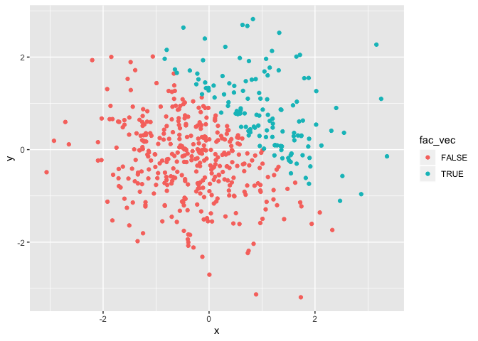

p8105\_hw1\_cx2227
================
Chuyue Xiang
2019-09-17

# Problem 1

``` r
p1_df = tibble(
  norm_samp = rnorm(8),
  norm_samp_pos = norm_samp > 0,
  vec_char = c ("1", "2", "3", "4", "5", "6", "7", "8"),
  vec_factor = factor(c("A", "A", "A", "B", "B", "B", "C", "C"))
)

mean(pull(p1_df, norm_samp))
```

    ## [1] -0.1736948

``` r
mean(pull(p1_df, norm_samp_pos))
```

    ## [1] 0.5

``` r
mean(pull(p1_df, vec_char))
```

    ## Warning in mean.default(pull(p1_df, vec_char)): argument is not numeric or
    ## logical: returning NA

    ## [1] NA

``` r
mean(pull(p1_df, vec_factor))
```

    ## Warning in mean.default(pull(p1_df, vec_factor)): argument is not numeric
    ## or logical: returning NA

    ## [1] NA

It only worked when taking the mean of “norm\_samp” and
“norm\_samp\_pos” and did not work when taking the mean of
“vec\_char” and
“vec\_factor”.

## Converting variables from one type to another

``` r
### convert the logical vector to numeric, and multiply the random sample by the result
as.numeric(pull(p1_df, norm_samp_pos)) * pull(p1_df, norm_samp)
```

    ## [1] 0.1228542 0.0000000 0.0000000 0.6611320 0.0000000 0.7919614 0.6549016
    ## [8] 0.0000000

``` r
### convert the logical vector to a factor, and multiply the random sample by the result
as.factor(pull(p1_df, norm_samp_pos)) * pull(p1_df, norm_samp)
```

    ## [1] NA NA NA NA NA NA NA NA

``` r
### convert the logical vector to a factor and then convert the result to numeric, and multiply the random sample by the result
as.numeric(as.factor(pull(p1_df, norm_samp_pos))) * pull(p1_df, norm_samp)
```

    ## [1]  0.2457085 -0.9862340 -1.1928174  1.3222641 -0.8480514  1.5839228
    ## [7]  1.3098032 -0.5933050

# Problem 2

``` r
p2_df = tibble(
  x = rnorm(500),
  y = rnorm(500),
  norm_samp_pos1 = x + y > 1,
  num_vec = as.numeric (norm_samp_pos1),
  fac_vec = as.factor (norm_samp_pos1)
)
```

## Short Description

  - the number of row in `p2_df` is 500 ;
  - the number of column in `p2_df` is 5 ;
  - the mean of x is -0.0496637 ;
  - the median of x is -0.1400508 ;
  - the standard deviation of x is 0.9900886 ;
  - the proportion of cases for which x + y \> 1 is 0.226

## Scatterplot

``` r
# Scatterplot for logical vector
ggplot(p2_df, aes( x = x, y = y, color = norm_samp_pos1)) + geom_point()
```

<!-- -->

``` r
# Scatterplot for numeric vector
ggplot(p2_df, aes( x = x, y = y, color = num_vec)) + geom_point()
```

<!-- -->

``` r
# Scatterplot for factor vector
ggplot(p2_df, aes( x = x, y = y, color = fac_vec)) + geom_point()
```

<!-- -->

### Comments

  - The first and third scatterplot have two colors: the red represents
    False and the blue represents True.
  - The second scatterplot has a numbered blue bar representing from
    0.00 to 1.00, with darker blue dots gathered in the lower left
    corner and lighter blue gathered in the upper right corner.
